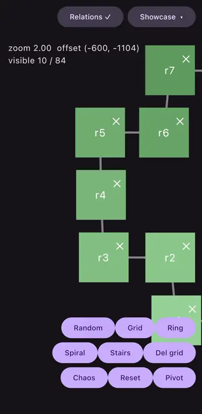
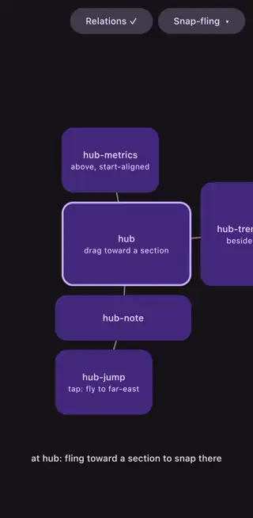
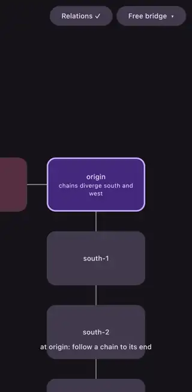
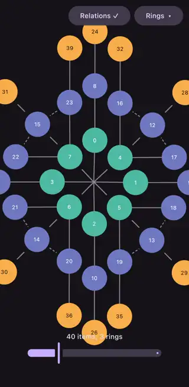
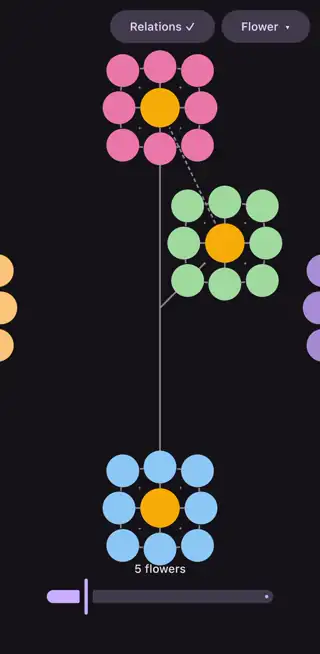
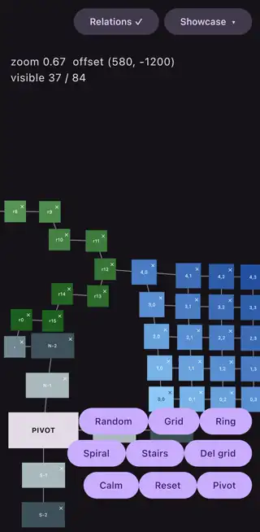

# LazySurface

**Build 2D surfaces where items say *who they sit next to*, not where they are. Lazy, on every Compose platform.**

[](https://central.sonatype.com/artifact/io.github.07jasjeet/lazysurface)


<p align="center">
  
</p>

Items live on an infinite plane, declared by **key** and by **spatial relations to each other** (`below("hero")`, `endOf("stats")`), never by index or coordinates. Composition, measurement and placement happen lazily as the viewport approaches an item.

- **Relations, not coordinates.** Declare `below("hero", margin = 16.dp)` and the layout follows, reflows and heals as content changes.
- **Lazy in 2D.** Items compose only when the viewport gets near them; everything further out is positioned provisionally and refined on approach.
- **A real gesture surface.** Pan, pinch zoom, fling with wall glide, snap paging, and platform or rubber-band overscroll.
- **A deterministic constraint solver.** Declared neighbours never overlap (hard floors); gaps and alignments blend softly under conflict, within a bounded per-frame budget.
- **Self-healing graph.** Removing an item splices the relations that pointed at it to its nearest surviving anchor; re-declaring a key wins its relations back.
- **100% `commonMain`.** One implementation for Android, iOS, desktop JVM and wasm.

## The samples

Every capture below is the demo app on an iPhone (`app/shared` runs unchanged on all targets).

<table>
  <tr>
    <td align="center"><br/><sub><b>Snap-fling</b>: the surface as a 2D pager: every fling lands centered on a section anchor.</sub></td>
    <td align="center"><br/><sub><b>Free bridge</b>: <code>Alignment.Free</code> links far-apart sections so navigation flies straight across.</sub></td>
    <td align="center"><br/><sub><b>Worst case</b>: a 400-cell lattice with a live perf HUD; toggle a contradiction and watch the solver pay for it.</sub></td>
  </tr>
  <tr>
    <td align="center"><br/><sub><b>Rings</b>: concentric rings grown from one routine (<code>placeAround</code>), any item count, no coordinates.</sub></td>
    <td align="center"><br/><sub><b>Flower</b>: the same routine nested: petals ring their flower, flowers ring the garden.</sub></td>
    <td align="center"><br/><sub><b>Chaos mode</b>: every item re-randomizes its size continuously; relations keep the neighbourhood coherent.</sub></td>
  </tr>
</table>

Run them yourself: `./gradlew :app:androidApp:installDebug`, `:app:desktopApp:run`, `:app:webApp:wasmJsBrowserDevelopmentRun`, or open `app/iosApp/iosApp.xcodeproj`.

## Quick start

```kotlin
commonMain.dependencies {
    implementation("io.github.07jasjeet:lazysurface:<latest-version>")
}
```

Published for Android, iOS, desktop JVM and wasm. On Android the Compose dependencies resolve to the same `androidx.compose.*` artifacts a plain Android app already ships.

```kotlin
val state = rememberLazySurfaceState()

LazySurface(
    state = state,
    modifier = Modifier.fillMaxSize(),
    contentPadding = PaddingValues(top = 90.dp, bottom = 120.dp), // clear your app bars
) {
    item(key = "hero", neighbors = { atPivot() }) {
        HeroCard(Modifier.fillParentMaxWidth(0.9f))
    }
    item(key = "stats", neighbors = {
        below("hero", margin = 16.dp)   // this item sits below "hero", 16dp away
    }) {
        StatsCard()
    }
    item(key = "sleep", neighbors = {
        endOf("stats", margin = 16.dp)  // this item sits at the end of "stats" (right in LTR)
    }) {
        SleepCard()
    }
}
```

Collections: `items(list, key = {...}, neighbors = { item -> ... })`.

## Core concepts

- **Items**: `item(key, contentType, neighbors) { content }`. Keys are unique (duplicates throw) and must be Bundle-storable on Android (strings, numbers, enums, `Pair`, `Parcelable`; a plain data class crashes at state save). Content is measured under unbounded constraints and must size itself: `Modifier.size` or `fillParentMaxWidth/Height/Size` (viewport size at 1x zoom). Plain `fillMaxWidth` is a no-op.
- **Relations** are phrased from the declaring item's own position: `below("a")` means "this item sits below a". They are bidirectional (declaring one side is enough), joint (an item with several relations is positioned against all of them), and direction-relative (`startOf`/`endOf` mirror under RTL). Cross-axis `Alignment`: `Start`, `Center` (default), `End`, plus `Free`. A pair related along both axes (`endOf(x); above(x)`) is a diagonal declaration and resolves to the corner where the two gaps meet.
- **Margins belong to relations**: `below("a", margin = 16.dp)` (or the infix `below("a") margin 16.dp`) declares the gap along that relation's axis, and it leaks into no other relation; a third item can hug either endpoint on the same side. Margins are not padding: they stay outside the content box so laziness can defer composition until the content itself would show.
- **`Alignment.Free`**: pure adjacency. Routes navigation, links the bounding shape, and enforces no-overlap; but never positions or aligns, so it can never fight the positioning relations. Every item still needs at least one non-Free relation path (Free-only connectivity throws at registration).
- **`LazySurfacePivot`** is the zero-size origin and graph root. `atPivot()` centers an item on it; the viewport starts there. Items with no relation chain to the pivot never render.

## Behaviour

### Placement

The graph is walked breadth-first from the pivot each pass. Items inside the resolution area (viewport plus one viewport per side) are measured; everything beyond is positioned provisionally (cached size, or zero until first measured). Items whose relation endpoints have not resolved defer within the pass; endpoints that never resolve are dropped for that frame only.

### Solver

All positions are then refined jointly over every declared relation:

| Constraint | Strength |
|---|---|
| Minimum separation along the relation axis (no overlap) | Hard |
| Exact declared gap | Soft |
| Cross-axis alignment | Soft |

Deterministic; a consistent graph converges in one sweep. Contradictions blend into visible warping and cost roughly 17x per frame (about 1 ms vs 0.05 ms for the 84-item demo). Treat warping as a declaration bug.

### Scrolling

- Clamped to the bounding shape of resolved items, per axis. Unmeasured one-hop neighbours open their side by a viewport so you can always scroll toward known-but-uncomposed content.
- Clamping is directional: an out-of-range offset can only move back, never snaps.
- `contentPadding` is screen space (constant across zoom). `null` allows content to stop half a viewport in.
- `settleIntoBounds = true`: a viewport stranded outside the shape by content changes springs back. User input always wins.
- Mass removal under the viewport snaps to the nearest surviving item.

### Gestures

- Pan, pinch zoom (`zoomRange`), fling with pointer-sample velocity. `interactable = false` disables input; programmatic scrolling still works.
- Children receive only confirmed single-finger taps. Movement past slop or a second finger belongs to the surface, so a pinch on a clickable card zooms instead of clicking. Children never see multi-touch.
- Wall glide: a diagonal fling into the shape's edge keeps momentum on the free axis.
- Leftover edge velocity goes to the overscroll effect (`LocalOverscrollFactory`).

### Removal healing

Relations pointing at a removed item splice to its nearest surviving anchor, preserving side and alignment, transitively across removal chains. Re-declaring a removed key revives it and wins back its original relations. Not configurable.

### Item animations

`Modifier.animateItem(placementSpec, fadeInSpec)` glides position changes and fades new items in. Purely visual: every position in `LazySurfaceState` stays logical. Re-entering the viewport snaps rather than gliding across the screen.

## Recipes

**Snap paging (the surface as a pager).** Every release lands centered on an anchor; the fling's projected landing picks the nearest one, so momentum decides the page and a still release re-centers:

```kotlin
LazySurface(
    state = state,
    flingBehavior = rememberSnapFlingBehavior(state) { it.key != "background" },
    settleIntoBounds = false,
) { ... }
```

Disable `settleIntoBounds` when snapping: the settle animation re-centers into the bounding shape while the snap wants the viewport on an anchor, and the two policies fight over where an idle viewport belongs. Custom policies implement the standard `SnapLayoutInfoProvider` via `LazySurfaceSnapLayoutInfoProvider(state, anchors)`.

**Fly to an item on tap.** `animateToItem` travels along relation edges; unmeasured targets are aimed at provisionally and corrected en route:

```kotlin
val scope = rememberCoroutineScope()
item(key = "hub", neighbors = { atPivot() }) {
    HubCard(onClick = { scope.launch { state.animateToItem("far-away-key") } })
}
```

**iOS-style overscroll everywhere.** The environment decides the overscroll feel; the library ships a rubber band:

```kotlin
CompositionLocalProvider(LocalOverscrollFactory provides RubberBandOverscrollFactory()) {
    LazySurface(...) { ... }
}
```

On iOS specifically, prefer this over the platform default: the platform effect is one-dimensional and fights 2D flings.

**Radial layouts.** Rings, orbits and flowers come out of one reusable routine built purely on relations; see `placeAround` in the sample app (`app/shared/.../PlaceAround.kt`): cardinals ray out on the axes, corners on the diagonals at a quarter margin, everything else links one layer in, and in-ring neighbours are joined by Free no-overlap edges. It rings items around *any* placed item, so clusters nest (the Flower sample is two levels of it).

**Frame budget and analytics.** The library exposes two hooks, both `null` by default with zero overhead, built for wiring into your analytics/telemetry pipeline as much as for local debugging:

```kotlin
// Per-frame phase timings: ship percentiles of Measure / Resolve / Solve to your
// metrics backend, or alert when solve time spikes (a contradiction signature).
LazySurfacePerformance.monitor = { phase, duration -> analytics.track(phase.name, duration) }

// Structured decision log: gesture, fling, clamp, navigation and recovery events,
// useful as breadcrumbs attached to bug reports from the field.
LazySurfaceDebug.logger = { crashReporter.log(it) }
```

Both run on the UI thread; record and hand off, never process inline.

**Relation lines overlay.** The demo app draws every item's declared relations as lines between cards (dotted = Free) with a `drawWithContent` modifier over `state.resolvedRects`; see `relationLines` in `app/shared` for the pattern.

## API

```kotlin
@Composable
fun LazySurface(
    modifier: Modifier = Modifier,
    state: LazySurfaceState,
    zoomRange: ClosedFloatingPointRange<Float> = 0.5f..2f,
    contentPadding: PaddingValues? = null,
    interactable: Boolean = true,
    settleIntoBounds: Boolean = true,
    flingBehavior: FlingBehavior? = null,
    content: LazySurfaceScope.() -> Unit,
)
```

`rememberLazySurfaceState(initialOffset, initialZoom)` survives configuration changes (offset and zoom persist; sizes re-measure).

| `LazySurfaceState` | |
|---|---|
| `offset`, `zoom`, `viewportSize` | Observable viewport position, scale, size |
| `itemsInfo`, `visibleItemsInfo` | Registered / visible items; visible entries carry the surface `rect` and `viewportRect` (on-screen footprint in viewport pixels) |
| `resolvedRects`, `resolvedBounds` | Known item rects and their union |
| `suspend animateToItem(key)` | Flies to an item along relation edges |

## Pitfalls

Each is a symptom you will actually see, why it happens, and the fix.

1. **A child is invisible or crashes with an infinity-constraints exception.** Items measure under unbounded constraints, so `fillMaxWidth` resolves to zero and scrollable children (e.g. `LazyColumn`) throw. Size content explicitly: `Modifier.size(...)` or `fillParentMaxWidth(fraction)`.
2. **An item never renders.** It has no relation chain to the pivot; unreachable items are never composed. Anchor something with `atPivot()` and relate everything else to it, directly or transitively.
3. **`IllegalArgumentException` about keys.** Duplicates throw at registration (`distinctBy` your source data). On Android, keys must also be Bundle-storable; a plain `data class Cell(...)` key crashes at state save; use `Pair`, a string, or a `Parcelable`.
4. **The layout warps and frame time jumps ~17x.** Two relations demand geometrically incompatible positions; the solver settles into a bounded tug-of-war every frame. Find the contradictory declaration (the Worst case sample's Conflict toggle shows the signature) and fix it.
5. **Two items overlap.** The solver only separates *declared* neighbours. Declare grids as full lattices (each cell relates to the cell before it in the row and the one above it in the column), not snake chains; or add `Free` edges purely as no-overlap guards.
6. **Removing one card reflows a whole arm of content.** Long single chains are fragile: healing reroutes the entire tail through the removed link. Prefer lattices or radial links with redundancy.
7. **A gap renders double or half of what you declared.** A margin belongs to one relation. If both directions of a pair are declared, give both the same margin; they state the same gap, not halves of it.
8. **Gaps grow but never shrink.** Declared gaps are exact in consistent graphs; under conflict the hard floor lets items sit farther apart, never closer. A "too large" gap usually means something else is pushing between the pair.
9. **`Modifier.offset` moved the pixels but nothing else followed.** Offsets are visual only; the logical rect (clamping, visibility, relations) stays put. Move items with relations, or animate with `Modifier.animateItem`.
10. **Deleting a connector did not hide its branch.** Healing splices relations through removed items by design. Remove the whole subtree to hide it.
11. **A "new" item teleported to an old spot.** Re-using a removed key revives its old relations (revival beats healing). Use a fresh key for genuinely new content.
12. **Item state vanished after a remove/re-add.** Per-item state does not survive removal; revived items recompose from scratch. Hoist state you need to keep.
13. **Padding looks wrong when zoomed.** `contentPadding` is screen space and already divided by zoom internally. Do not pre-scale it.
14. **Registration throws about Free-only connectivity or negative margins.** Free relations never position, so an item connected only by Free links could never resolve; and margins are separation distances, so negatives are rejected; to pull an item closer than a neighbour's edge, size the neighbour (or an invisible scaffold item) instead.

## Development

100% `commonMain`; targets: Android (`minSdk 24`), iOS (`iosArm64`, `iosSimulatorArm64`), desktop JVM, `wasmJs`. JDK 21, Android SDK 36+; versions pinned in `gradle/libs.versions.toml`; keep `kotlin` and `composeMultiplatform` in lockstep with consuming apps.

| Module | |
|---|---|
| `LazySurface/` | The library |
| `app/shared/` | Demo UI (`commonMain`) |
| `app/androidApp/`, `app/desktopApp/`, `app/webApp/`, `app/iosApp/` | Platform entry points |

| | |
|---|---|
| Tests | `./gradlew :LazySurface:desktopTest` |
| Android demo | `./gradlew :app:androidApp:installDebug` |
| Desktop demo | `./gradlew :app:desktopApp:run` |
| Web demo | `./gradlew :app:webApp:wasmJsBrowserDevelopmentRun` |
| iOS demo | open `app/iosApp/iosApp.xcodeproj` |
| Android AAR | `./gradlew :LazySurface:bundleAndroidMainAar` |

- iOS: simulator builds work on a fresh clone; device builds need `TEAM_ID=...` in `app/iosApp/Configuration/Local.xcconfig` (gitignored). Without a full Xcode install the shared module skips its framework link tasks automatically.
- Keep library code free of JVM-only APIs (`String.format`, `System.currentTimeMillis`); the iOS compilation catches them, so build all targets before assuming green.
- Do not apply the `org.jetbrains.compose` Gradle plugin to modules that also apply AGP's KMP library plugin (incompatible resources wiring). Only `app:desktopApp` and `app:webApp` apply it.
- Profile release builds: on Android an unminified, debug-signed, `<profileable>` build; on iOS set the Xcode scheme's build configuration to Release (Kotlin/Native debug binaries are unoptimized). The Worst case sample is the perf harness; its HUD reports the library's `Measure` / `Resolve` / `Solve` phases live. `ConstraintSolverPerfTest` is a JVM micro-benchmark, not device numbers.

## License

[MIT](LICENSE)
